# 前言

学习该项目的目标：

- 快速了解处理器的工作原理
- 快速掌握RISC-V的特性
- 锻炼Verilog代码编写能力
 
 
RISC-V是一种ISA（指令集架构）指令集

- 精简指令集
  - RISC-V
  - MIPS
  - ARM
- 复杂指令集
  - X86

# 总体框架

在写代码前先要明确以下

- 设计一个处理器需要什么模块
- 每个模块用来干嘛的

---

## 分析

千里之行，始于足下：首先实现单周期，五指令的功能，后面再继续完善成多周期，最终实现流水线


```
单周期：暂时还不涉及流水线
五指令：为了通过RISC-V官方的测试文件，需要涉及到5条指令
```

知己知彼百战百胜：要知道RISC-V具有模块化的特点，从图中可以清晰感受到这种模块化的特点

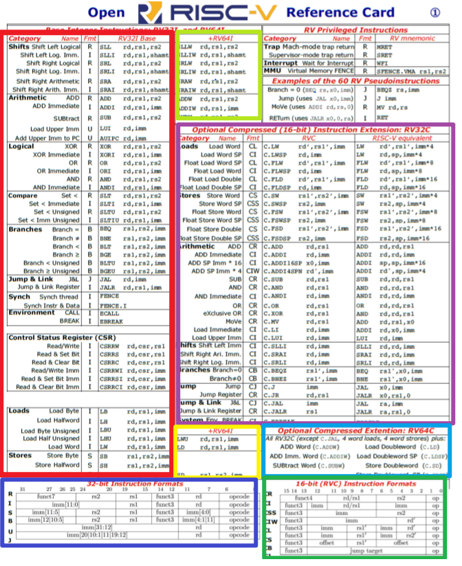

接下来要知道处理器的结构

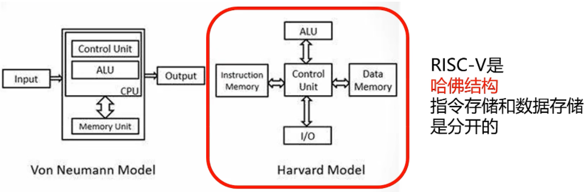

从图中可以看到，指令和数据分别存放在单独的存储器中，因此处理器采用哈佛结构；由于目前只是实现add指令，还没有数据读写指令，于是暂时不会用到数据存储器，指令存储器用来存储指令，在CPU上电后，使用pc_reg将指令从指令存储器中取出来，由此可以知道，pc_reg是决定哪条指令将要被读取（掌管后宫的）；取指得到的指令被送到ctrl模块进行译码，可以用下面的图帮助理解

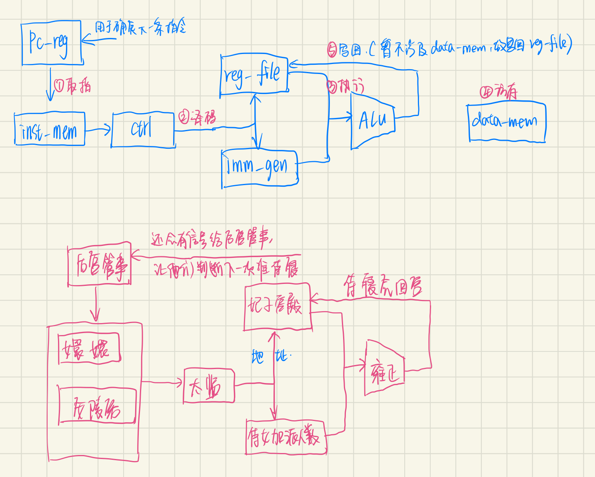

## 总结

综上，要实现一个单周期单指令的CPU需要用到左侧的指令，以及需要设计右侧的模块


# 具体实现

## 取指

### 指令存储器模块:inst_rom

指令存储器里面存的是指令，这些指令只会被读取，不会被修改，于是一般选用rom作为指令存储器

明确这个模块的输入输出：

- 输入：指令当前地址
- 输出：通过输入的地址索引到的指令

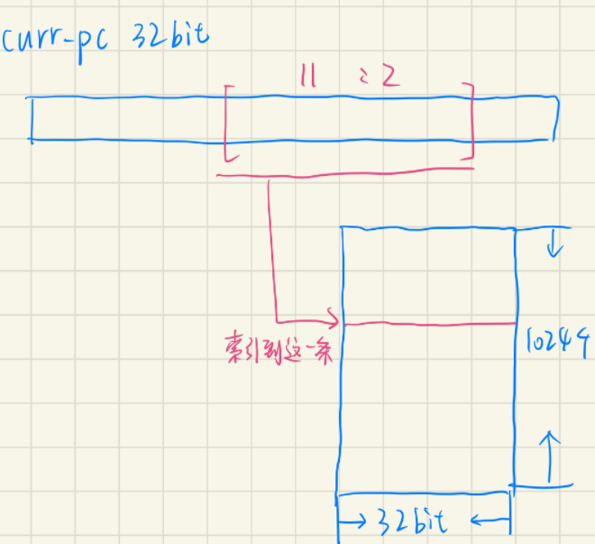

#### 疑问

- 为什么不将当前地址的32位全部用来索引指令，而是选取其中的 11 : 2

  - 回答为啥从2开始：curr_pc 有 32位，太长了，于是使用16进制表示，PC地址都是用+4来表示下一条地址，于是舍弃0,1这两位，从2开始，这就相当于将curr_pc地址除以4，即让16进制表示的curr_pc地址换成二进制后，向右移2位

    如：

    00000004——右移2位（4=0100）——00000001

    00000008——（8=1000）——00000010
    
  - 这里的curr_pc相当于汇编程序中第一列数据，在汇编程序中就已经定义好了，每个地址对应的指令（详细见下面的伪指令部分）


### pc寄存器模块:pc_reg

用来确定指令的地址，这之前还需要使用一个多路选择器 mux_pc 来选择用哪一个地址

### mux_pc模块

该模块是一个多路选择器，由于前面提到的指令中 jal、bne 指令与地址有关，这两个指令会得到各自的地址，否则就直接将当前地址+4得到下一个地址

### 代码跑起来

因为我之前一直使用的Quartus，所以在把代码放到Linux之前我先试着在Quartus上面运行，结果出现很多报错，以下记录：

#### 报错

```
Verilog语法错误：
```

1. always块中的输出信号赋值，都要在端口定义处将其定义为 reg，

2. always块为组合逻辑，赋值用=,always块为时序逻辑，赋值用<=

   正确写法：

   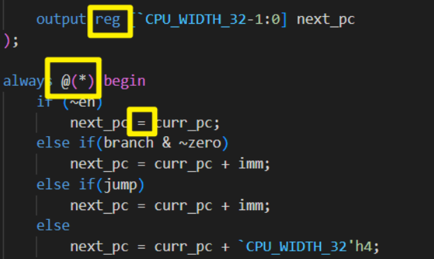

```
`include引入宏定义文件出错：
```

- 错误写法：`include "define.v"
- 正确写法：`include "G:/CPU/06-CPU/code/define.v"——使用绝对路径

```
在顶层文件中，没有always块赋值，在端口定义时，不能出现reg，此时的端口是一条线，将各个模块来连接起来即可！！
这个错误出现好几次了，需要注意！！
```

- 错误写法：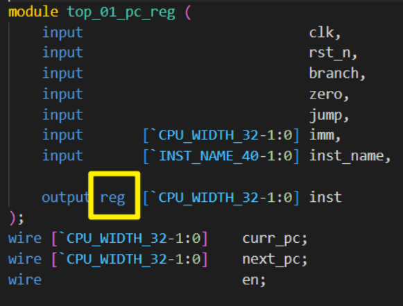

```
在tb测试文件中，无法成功读取到add文件中的指令到inst_rom_home中，
```

- 报错写法：

  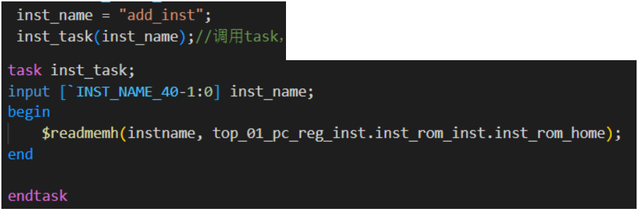

- 修改写法：将add所在文件的绝对路径放入$ readmemh中进行读取

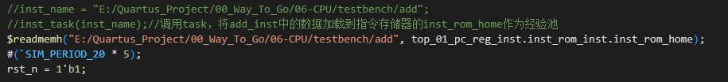

### 框图

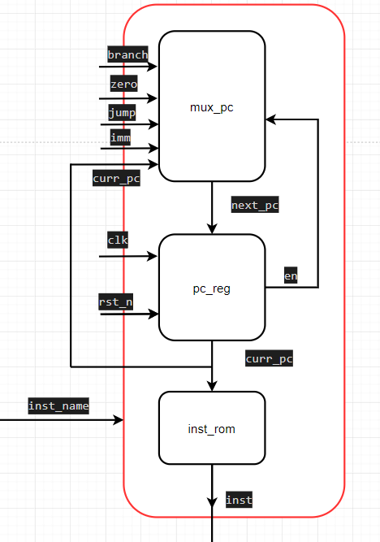

## 译码模块

这部分模块的功能是将取指阶段，从inst_rom中得到的inst指令进行译码

译码得到寄存器的地址以及控制指令

可以结合下面的流程图来理解译码模块中输出信号的作用

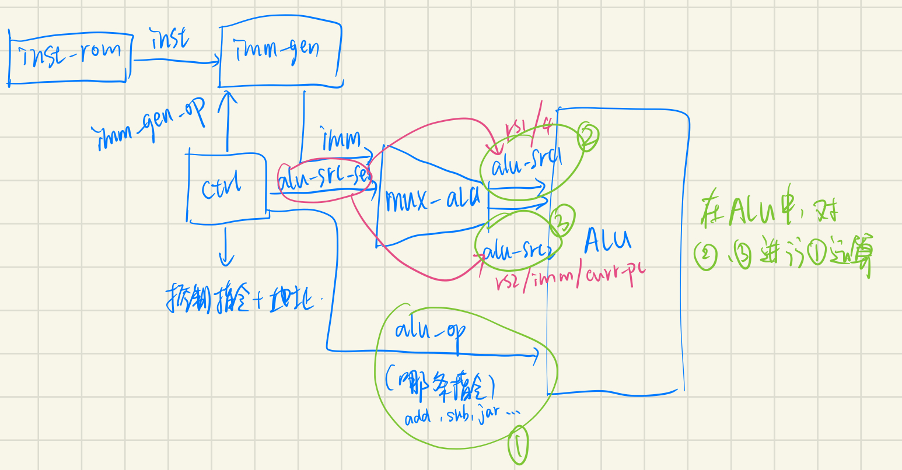

在译码模块中，核心部分在，使用指令集表去划分出32位中每部分，在划分时，可以从大的方面入手：

- 先通过opcode先将指令划分为6个大部分
- 再通过 funct3 和 funct7 来划分这6个部分中，分别有哪些具体的指令

### 报错

```
Verilog语法错误：
```

定义初值时，如果变量num位宽是5

- 错误写法：num = 5'b0 ;
- 正确写法：num = 5'd0 ; 或者num = 5'h0 ;

## 立即数扩展模块

在进行立即数扩展时，总结出如下的步骤：

```
1.首先画出inst/imm图，将imm与inst位置对应起来
2.判断出指令格式中，不同指令对应的imm一共有多少位
3.使用inst的最高位将imm扩展到32位——符号位扩展
4.依次将imm所对应到的inst位置上的数填入扩展后的imm上
注意:
存在imm[12|10:5]这种立即数，将imm[12]对应到inst[31],imm[10:5]对应到inst[30:25]
当imm是从1开始的，那么扩展的imm最低位是1'b0
```

符号位扩展：将imm最高位用来弥补扩展后的立即数的高位部分

指令lui是在立即数扩展中实现立即数左移12位的

```
lui：将立即数左移12位后，赋值给rd
```


### 框图

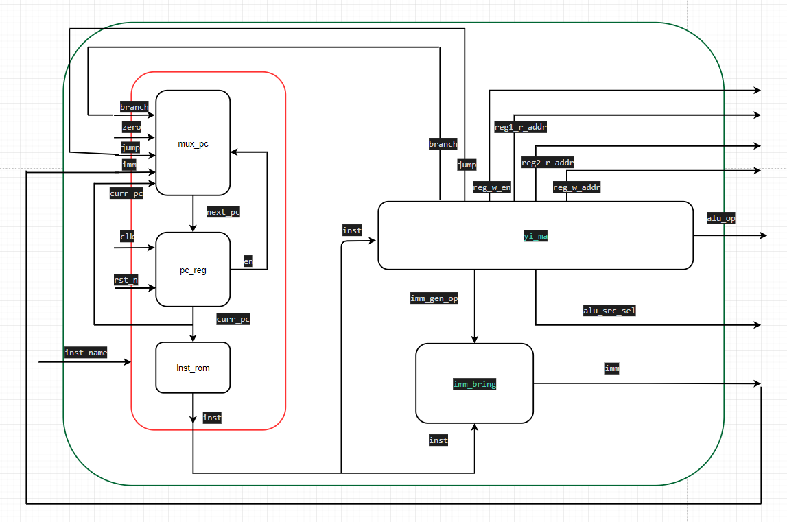

## 寄存器堆模块

寄存器堆用来存放外部写入的数据，然后通过输入的地址去索引对应位置上的数据，将该模块的输出作为执行模块中的执行元素

### 框图

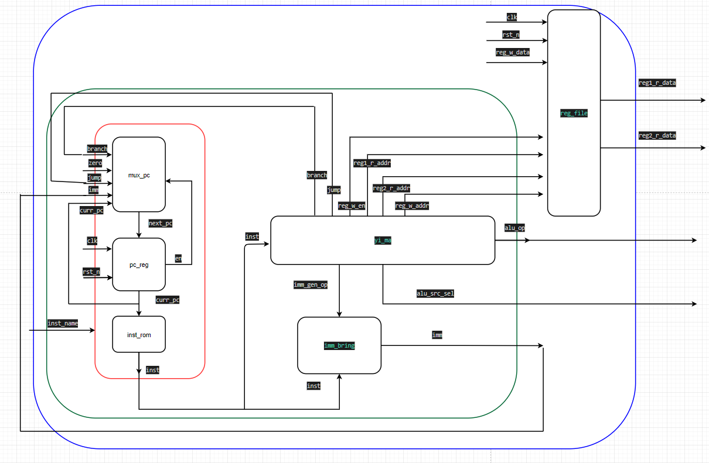

## mux_ alu模块

这个模块用来选择执行模块的2个执行元素的内容，2个执行元素有以下4中取值情况：

- rs1、rs2
- rs1、imm
- 4、pc
- imm左移12位、pc

该模块就是用来确定是哪一种情况，进而得到2个执行元素

```
注意：上面中的第4点这个是用于auipc指令的，这次项目暂时还没有用到该指令
因此可以开到，项目中的mux_alu模块中只有上面分点的前三种情况
```

## 顶层模块

### 框图

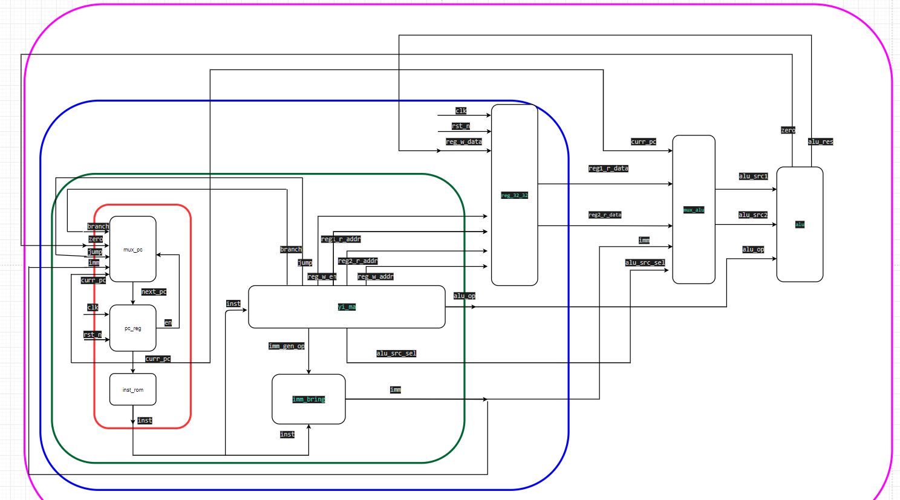

## 伪指令

伪指令暂时先用到下面的3条：

---

- nop: addi x0 x0 0——使用addi指令，将寄存器0与立即数0相加后存放到寄存器0中，但是寄存器0不可以写入数据，因此相加后的数据无法写入寄存器0

- j伪指令：对应jal跳转指令

- li伪指令：将立即数存放到目标寄存器中

### 伪指令的作用

使用伪指令所表示的汇编程序，不仅可以用来做兼容性测试，还能直接通过汇编程序判断CPU是否编写成功

---

下面介绍一下如何简单快速看懂该项目涉及到的汇编程序：

第2列是机器码，但是不方便人去阅读，于是，我们通过将其和我们写的第3列中的指令对应起来，第2列给计算机看，第3、4列给人看

```
下方红色字是重点！
```

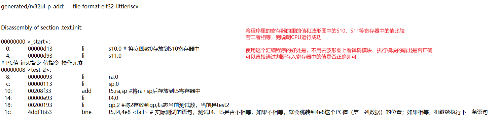

# 调试方法

- 打断点
- 屏蔽出错那一行，然后运行看结果

---

我在对照着汇编程序检查波形图时，发现当PC=54时，即指令lui下，无法将立即数左移12位后赋值给sp寄存器；于是将译码和执行模块的波形添加后，检查是否译码执行成功

PC = 54时，此时的指令为lui:

```
ffff8137
imm[31:12]: 1111_1111_1111_1111_1000_    
rd: 0001_0 
opcode: 011_0111
```

